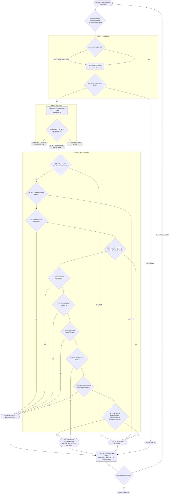

# 🛡️ Плейбук: анализ навыков ИИ-агентов на уязвимости

> Формализованная методика ручного анализа. Открой и иди по шагам: **Шаг 0 → Шаг 1 → … → Шаг 15**.
> Каждый шаг содержит ветки «если X — то Y». Визуальная схема: [`playbook-flowchart.html`](./playbook-flowchart.html). Результат фиксируется протоколом: [`skill-assessment-protocol.md`](./skill-assessment-protocol.md).

---

## ⚠️ Три золотых правила (действуют всегда)

1. **НИКОГДА не запускай анализируемый код.** Даже «безобидный» установщик. Только статическое чтение.
2. **Работай в изоляции.** ВМ/контейнер без доступa к рабочим секретам; проверь, что у среды нет токенов, SSH-ключей и доступа к прод-сетям.
3. **Находка — сигнал, а не приговор.** Фиксируй контекст и давай оценку уверенности: `подтверждено / вероятно / требует проверки`.

---

## 🧭 Как читать этот плейбук (прочти перед стартом)

**Структура.** Плейбук — это маршрут из 16 шагов: `S0 → S1 → … → S15`. Идёшь строго по порядку, пропуски — только там, где явно разрешено («сокращённый проход»). Нумерация с нуля — как в коде.

**Код шага = `S` + номер** (`S0`, `S7`, `S14`). Коды нужны, чтобы кратко ссылаться на шаги в протоколе, в блок-схеме и в разговоре («прошёл S5–S14, всё чисто»). Заголовок каждого шага расшифровывает код: «### Шаг 7 `S7`. Перехват инструкций» = это `S7`.

**Где какой этап:**

| Коды | Этап | Что делаешь |
|---|---|---|
| `S0–S2` | I. Подготовка | Понять, что проверяешь и насколько доверяем источнику |
| `S3–S4` | II. Автоскан | Прогнать через сканер, разобрать его находки |
| `S5–S14` | III. Ручной проход | 10 чек-листов по категориям угроз — глазами |
| `S15` | IV. Вердикт | Свести всё в протокол с оценкой |

**Связь с кодом детектора.** Шаги ручного прохода `S5–S12` соответствуют правилам в `src/convex/analyzer.ts` — то, что автоматика ищет регэкспами, ты проверяешь глазами (и ищешь то, что регэкспы не ловят):

| Шаг | Правило(а) детектора |
|---|---|
| `S5` Обфускация | `CMD_OBFUSCATION`, `ENCODED_SECRETS` |
| `S6` Эксфильтрация | `EXFIL_HTTP`, `EXFIL_ENV` |
| `S7` Инъекции | `PROMPT_INJECTION` |
| `S8` Shadow-инструменты | `TOOL_HIJACK` |
| `S9` Закрепление | `PERSISTENCE` |
| `S10` Эскалация | `PRIVILEGE_ESCALATION` |
| `S11` Тихая установка | `SILENT_INSTALL` |
| `S12` Доступ к ФС | `FILE_SWEEP` |
| `S13` Сеть, `S14` Комбинаторика | — только вручную, в детекторе их нет |

**Как читать каждый шаг.** У шага три части: **«Ищи»** — какие паттерны смотреть в тексте навыка; **ветки «если → то»** — что делать при находке или её отсутствии; **стрелка в конец** — куда переходить дальше. Ветка 🔴 «стоп» означает: анализ закончен досрочно, неси вердикт в S15.

**Мини-пример прохода.** Вставили MCP-конфиг → `S0`: источник — чат с незнакомцем → пометка `untrusted` → `S1`: записали паспорт → `S2`: поверхность есть (MCP запускает команды) → `S3`: сканер выдал 92 → `S4`: находки подтверждаем → `S5–S14`: идём по чек-листам, на `S8` видим `allowedTools: ["*"]` — цитируем, помечаем HIGH→CRITICAL → `S15`: протокол с вердиктом «отклонить».

**Не путай:** `S3` (прогнать через сканер — программа) ≠ `S5–S14` (проверить руками — ты). Автоматика может ошибаться в обе стороны: и пропустить, и наорать. Пример: сам сканер оценил свой исходный код на 100/100 — все 6 находок оказались ложными (см. `scores/SCANNER-SCORE.md`).

---

## Этап I. Подготовка (Шаги 0–2)

### Шаг 0 `S0`. Оцени источник
Откуда взят навык/конфиг?
- **Официальный маркетплейс + много ревьюеров** → риск ниже, иди в Шаг 1.
- **Личный блог / чат / «скинь файл»** → подозрительный канал; пометь как `source: untrusted`, иди в Шаг 1 с повышенной настороженностью.
- **Публичный git без звёзд и истории** → смотри историю коммитов (Шаг 2). Внезапные «сжатые» коммиты (`squash`) — жёлтый флаг.

### Шаг 1 `S1`. Зафиксируй входные данные
Составь паспорт анализа: имя, версия/хэш, дата, источник, тип (`tool | mcp | prompt | extension`). Без паспорта не переходи дальше — результат нельзя будет воспроизвести.

### Шаг 2 `S2`. Определи поверхность атаки
Что теоретически может делать этот навык в твоей среде?
- **Tool** — исполнение команд/кода в твоей машине.
- **MCP-конфиг** — запуск сторонних серверов, доступ к дополнительным инструментам.
- **Prompt/extension** — влияние на поведение агента (инъекции).
→ Запиши максимально возможный ущерб. Если поверхность пуста — анализ закончен: `risк = 0`.

---

## Этап II. Автоматический проход (Шаги 3–4)

### Шаг 3 `S3`. Прогони через скилл-сканер
Вставь манифест в сканер, получи оценку 0–100 и список находок с цитатами.
- **Оценка 0 и findings пусты** → не расслабляйся: детектор эвристический. Иди в Шаг 5 (ручной проход всё равно обязателен).
- **Оценка ≥ 60 (high/critical)** → сначала разбери находки по Шагу 4, затем ручной проход Шагов 5–14 обязателен.
- **Оценка 1–59** → разбери находки (Шаг 4), затем ручной проход по сокращённому чеклисту (Шаги 5, 7, 9, 11, 13).

### Шаг 4 `S4`. Разбери каждую находку
Для каждой: открой цитату-доказательство → реши, ложное срабатывание или нет.
- **Ложное срабатывание** (например, легитимный `curl` в сборке к своему домену) → пометь `FP` и обоснование.
- **Подтверждено** → добавь в протокол с категорией и контекстом.
- **Не уверен** → пометь `требует проверки` и обязательно добей в ручном проходе.

---

## Этап III. Ручной проход (Шаги 5–14)

### Шаг 5 `S5`. Обфускация
Ищи: base64/hex-блобы, `eval(atob(...))`, `\x`-последовательности, «двойное» кодирование, сжатые payload'ы.
- **Есть закодированные блобы** → декодируй В ИЗОЛЯЦИИ (`base64 -d`, CyberChef — не исполняя!) и анализируй содержимое по этому же плейбуку с Шага 2. Каждый уровень кодировки = +1 к подозрению.
- **Блоб декодируется в исполняемый код** → `CRITICAL`, стоп-флаг: навык пытался скрыть смысл. Дальше можно не копать — вердикт готов.
- **Ничего закодированного нет** → Шаг 6.

### Шаг 6 `S6`. Эксфильтрация данных
Ищи: `curl/wget/fetch/requests.post` на внешние хосты, сбор `process.env`, обращения к `~/.ssh`, `id_rsa`, `.env`, браузерным профилям.
- **Сеть + секреты/файлы в одном навыке** → `CRITICAL`: это готовый эксфильтрационный конвейер.
- **Сеть есть, секретов нет** → проверь домены: WHOIS, возраст, репутация. `VERY_SUS` если домен свежий/паленый.
- **Секретов нет, сети нет** → Шаг 7.

### Шаг 7 `S7`. Перехват инструкций (prompt injection)
Ищи: «ignore previous instructions», «do not tell the user», «system prompt:», «you are now a…», скрытые текстовые блоки, HTML-комментарии с инструкциями, гомоглифы/юникод-трюки в «невинных» строках.
- **Прямая инъекция найдена** → `CRITICAL` для prompt/extension навыков, `HIGH` для остальных.
- **Косвенные признаки** (навязчивые «всегда делай X», «никогда не упоминай Y») → `MEDIUM`, пометить `требует проверки`.
- **Чисто** → Шаг 8.

### Шаг 8 `S8`. Скрытые инструменты и shadow-конфиги (для MCP)
Ищи: лишние `mcpServers`, `allowedTools: ["*"]`, `autoApprove/alwaysAllow: true`, `--yolo/--dangerously` флаги, `npx … | sh`.
- **Скрытый сервер или wildcard-доступ** → `HIGH`–`CRITICAL` в зависимости от capabilities сервера.
- **Всё явно и минимально** → Шаг 9.

### Шаг 9 `S9`. Закрепление в системе (persistence)
Ищи: `crontab`, правки `~/.bashrc|.zshrc`, LaunchAgents, systemd units, registry Run-ключи, автозапуск в конфигах.
- **Пишет в автозагрузку** → `HIGH`: навык хочет пережить перезапуск. Спроси себя: зачем хелперу это?
- **Нет** → Шаг 10.

### Шаг 10 `S10`. Эскалация привилегий
Ищи: `sudo`, setuid/setgid, `unshare/nsenter/capsh`, чтение `/etc/shadow`, операции с контейнерами (`docker run --privileged`).
- **Эскалация без объяснимой причины** → `HIGH`. Легитимные причины редки и должны быть явно задокументированы в README навыка.
- **Нет** → Шаг 11.

### Шаг 11 `S11`. Тихая установка ПО
Ищи: `curl … | sh`, `npm/pip install` в цепочках с `&&`/`;`, `apt-get install -y` без предупреждений.
- **Установка без запроса пользователя** → `MEDIUM`–`HIGH`. Проверь, какие пакеты и откуда: свежие/тайпсквоттинг-пакеты = `HIGH`.
- **Нет** → Шаг 12.

### Шаг 12 `S12`. Широкий доступ к ФС
Ищи: `find /`, `find ~`, `rm -rf`, `chmod 777`, `shutil.rmtree`, glob-обходы `**/*`.
- **Массовое чтение/удаление вне рабочей папки** → `MEDIUM`–`HIGH` по масштабу.
- **Доступ только к своему рабочему каталогу** → ок.

### Шаг 13 `S13`. Сетевые сюрпризы
Ищи: нестандартные порты, `nc/netcat`, raw-сокеты, DNS-туннели (длинные subdomain-цепочки), webhook-URL в конфигах.
- **Есть** → сопоставь с заявленной функциональностью. Не объяснимо = `HIGH`.
- **Нет** → Шаг 14.

### Шаг 14 `S14`. Комбинаторика
Сложи картину: по отдельности безобидные куски вместе = атака.
- **Сеть + секреты** (Шаг 6) = эксфильтрация.
- **Инъекция (Шаг 7) + tool-доступ (Шаг 8)** = дистанционное управление агентом.
- **Установка (Шаг 11) + persistence (Шаг 9)** = заражение машины.
- **Любая такая комбинация** → `CRITICAL`, независимо от индивидуальных весов.

---

## Этап IV. Вердикт (Шаг 15)

### Шаг 15 `S15`. Сформируй протокол
| Поле | Что писать |
|---|---|
| Вердикт | `ЧИСТО / НИЗКИЙ / СРЕДНИЙ / ВЫСОКИЙ / КРИТИЧЕСКИЙ` |
| Оценка | итог сканера ± ручная корректировка с обоснованием |
| Находки | подтверждённые + FP с объяснениями |
| Уверенность | `высокая / средняя / низкая` |
| Рекомендация | `можно использовать / использовать с ограничениями (какими) / отклонить` |

- **CRITICAL-флаги (Шаги 5, 6, 8, 14)** → рекомендация «отклонить» без исключений.
- **Только MEDIUM и ниже** → «можно с ограничениями»: перечисли конкретные условия (без сети, без секретов, в песочнице).
- **Чисто по всем шагам** → «можно использовать», но зафиксируй дату и хэш: при обновлении навыка анализ повторяется с нуля.

> **Обновление навыка = новый анализ.** Хэш изменился — плейбук проходится заново, старый вердикт недействителен.
